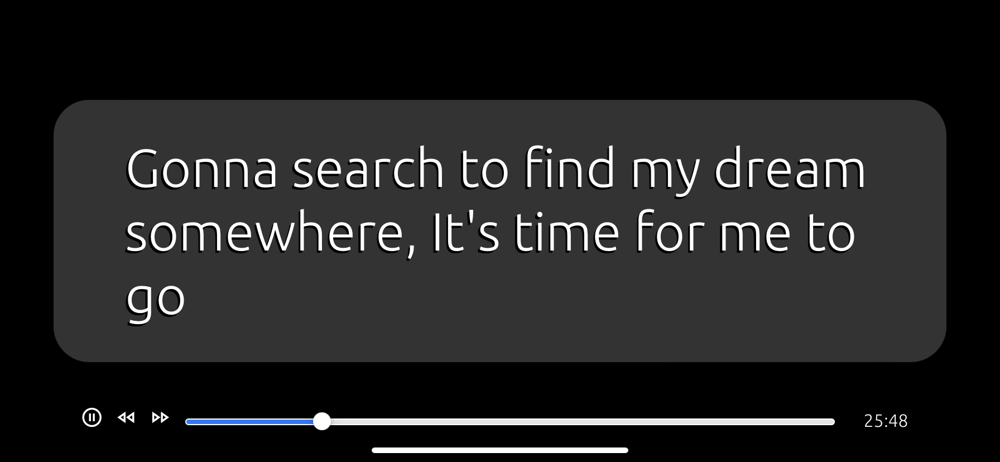

# srt-player

A standalone *subtitles-only* player for SRT format subtitles. 
You can run this as a web app by navigating to https://srtplayer.surge.sh/,
and pinning the app to your home screen.

## Why play only subtitles?

This was made as a companion app to analog video formats that don't include subtitles.
Say, for example, you want to watch a classic anime film on Japanese Laserdisc.
With this app you can put a phone or tablet below your TV playing the subs synchronized with your media
and enjoy the film in its original language.

## Finding subs

That one's easy. Go to [opensubtitles.org](https://www.opensubtitles.org/).
Through an awe-inspiring community effort, they seem to have subtitles for anything and everything.
Search by title, choose your language, usually sort by downloads or look for high quality or trusted uploaders.
Download SRT format. You may get a zip but you can extract this on the files app of your device.

I looked into adding this functionality to the app, but it would require an opensubtitles API key.
Neither bundling my own key with this app, nor asking every user to add their own key, is really feasible,
so for the time being please download subs manually in another window.

## Meta

Use the Issues tab for bugs and/or feature requests. This is a very side project so please be understanding.

## Contact

Find me @partlyhuman everywhere.